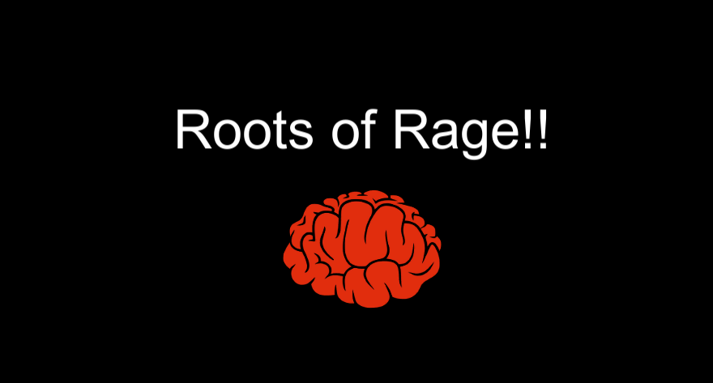
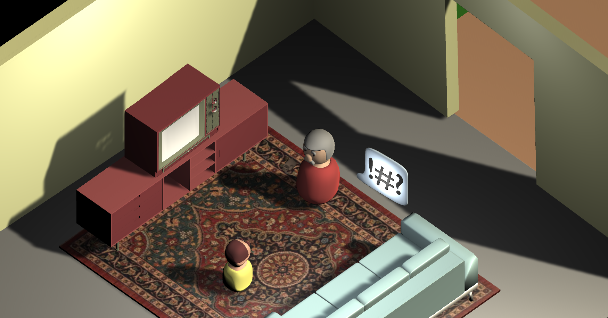
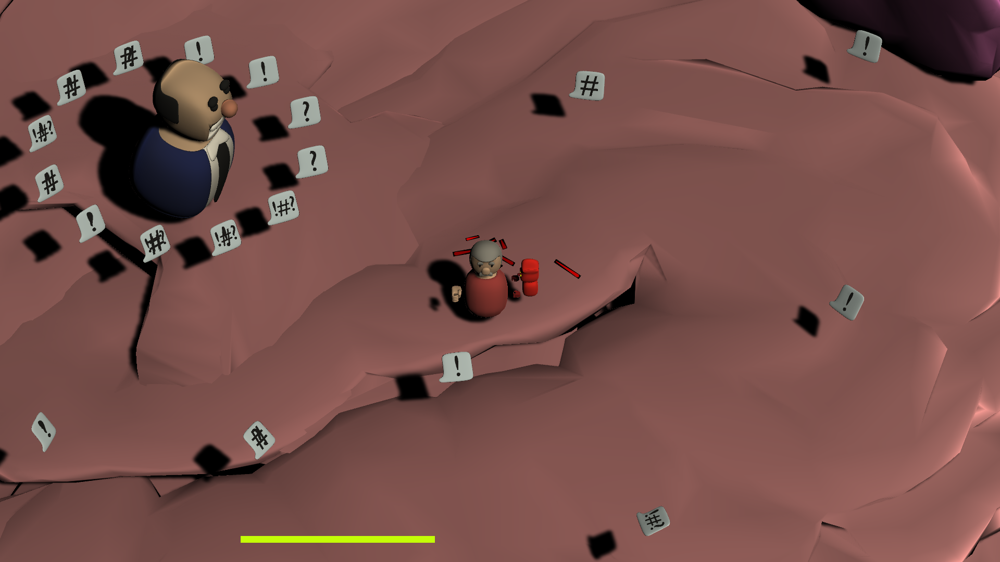
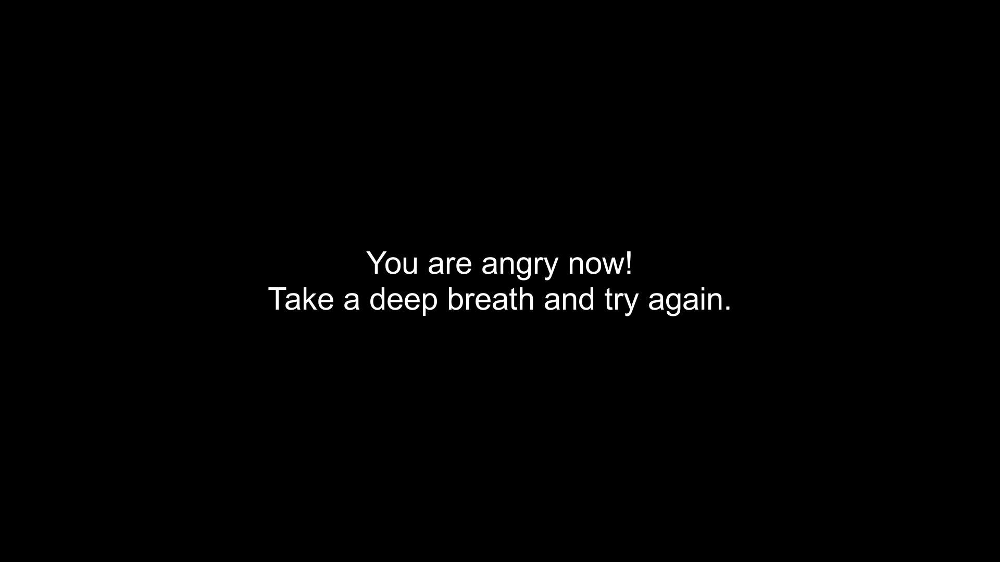

</img>

The "Roots of Rage" is a game that supposed to be funny for GlobalGameJam 2023 about "Roots". Developed in <a href="https://globalgamejam.ir">TehranGameJam</a>.

You Play as A father cursing his son, and then he goes to his brain to find roots of his anger, in the brain his boss shoots "bad words" to him and he should run away to keep himself calm.
  

# How to play

1. Run away with 'W-A-S-D' from bad words of you boss to keep your self calm.

2. Punch with Left Click and destroy anger zoombes(red chasers).

3. You rage, you lose.
  

# Play Inside Browser
<a href="https://play.unity.com/mg/other/webgl-builds-304998">Link</a>  
From Iran? Make sure you have anti filter on ;)
  

# First CutScene
</img>
  

# Game Play
</img>
  

# Lose Screen
</img>
  

# Developers
1. <a href="https://ali77gh.ir">Ali Ghahremani</a> (Code Writer)
  
2. <a href="https://instagram.com/mat.in_gh">Matin Ghahremani</a> (3D Designer)
  
3. <a href="https://github.com/pharakh">Omid Ghahremani</a> (Another Code Writer)
  
4. <a href="https://github.com/LordEvil1">Mahdi Ghahremani</a> (Animator and Code Writer)